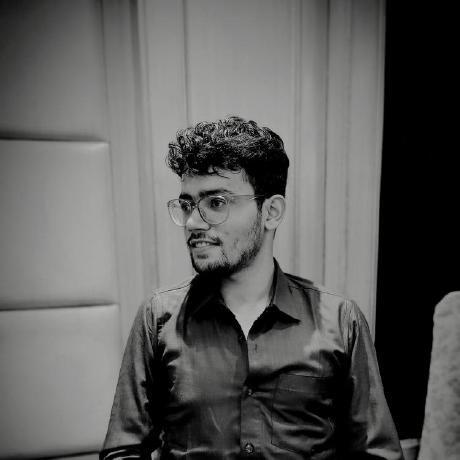
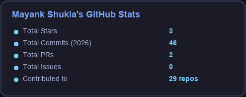
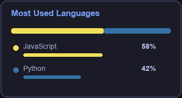
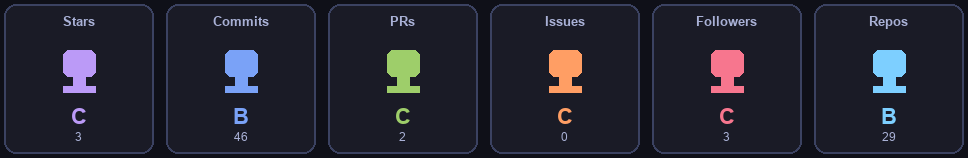

  

  
  
  
  
  

---

<!--  -->

### about

I'm **Mayank**. CS student at MSIT, Delhi. I like building things that have to work outside a Jupyter notebook — products, robots, and models squeezed onto hardware that did not ask for this.

Right now I ship AI at **[JourneyLabel](https://mayankshuklaa.netlify.app)** (travel recs, booking automation). Before that I did LLM reporting on construction sites, realtime commerce backends, and battery / aerospace modeling with **ISRO**.

When I'm not doing that: **MIKO** (a personal AI on a Raspberry Pi), hackathons, and running **Geek Room** at college.

→ **[portfolio](https://mayankshuklaa.netlify.app)**

| now | open to | learning | ask me |
| --- | --- | --- | --- |
| AI, robotics, SDE prep | AI, IoT, open source | Transformers, GANs | ML, DSA, leadership |

 

---

### current vibe

  

<i>the model after I said "it's only on a Raspberry Pi, how bad can it be"</i>

---

### stack

  

  

  
  

---

### github

  
  

  

  

<table align="center">
  <tr>
    <td>
      
    </td>
    <td align="center" valign="middle">
      
    </td>
    <td>
      
    </td>
  </tr>
</table>
